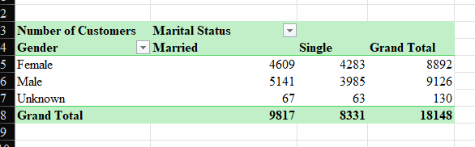
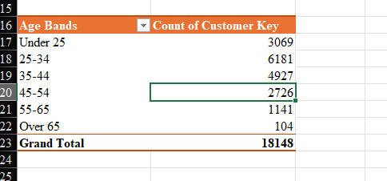
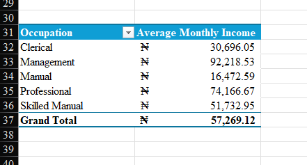
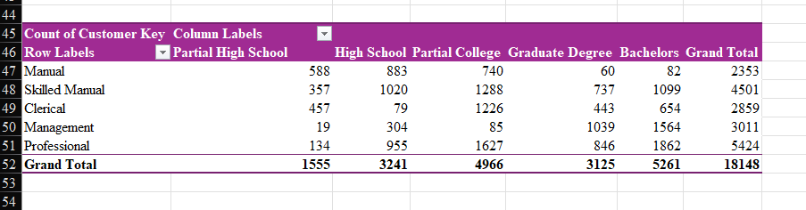
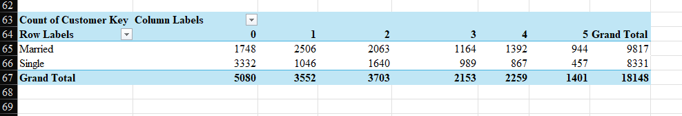

# 📊 AdventureWorks Customer Project Dashboard (Excel)

## 📌 Overview
This project is an **Excel Macro‑Enabled Workbook** (.xlsm) that analyzes the AdventureWorks customer dataset.  
It uses **PivotTables**, **PivotCharts**, and **Slicers** to explore customer demographics, income patterns, and other key insights.

---

## 📂 What's Included
- **Excel file**: AdventureWorks_Customer_Project.xlsm
- **README**: Project description and usage guide
- **Screenshots**: Visual previews of the PivotTables

---

## 🛠 Features
- **Demographic analysis** by Age Band, Gender, and Marital Status
- **Income trends** by Age Band and Education Level
- **Occupation vs. Home Ownership** insights
- Interactive **Slicers** for quick filtering
- Clean **custom sorting** for Age Bands (Under 25 → Over 65)

---

## 📊 Data Preparation
- Standardized Gender values (e.g., M → Male, F → Female, NA → Unknown)
- Calculated Age from Date of Birth, then grouped into Age Bands
- Formatted the Monthly Income as accounting
- Labelled blanks as Unknown for consistency

---

## 📸 Visual Preview

  
  
  

---

## 🚀 How to Use
1. Download the .xlsm file from this repository.
2. Open it in *Microsoft Excel (desktop)*.
3. If prompted:
   - Click **Enable Editing**
   - Click **Enable Content** (to allow macros)
4. Use slicers to filter by Age Band, Gender, Marital Status, Education, or Occupation.

---

## 📌 Requirements
- Microsoft Excel (desktop version)
- Macros enabled

---

## 📜 License

For educational and portfolio purposes. Dataset is based on the **AdventureWorks** sample database.

